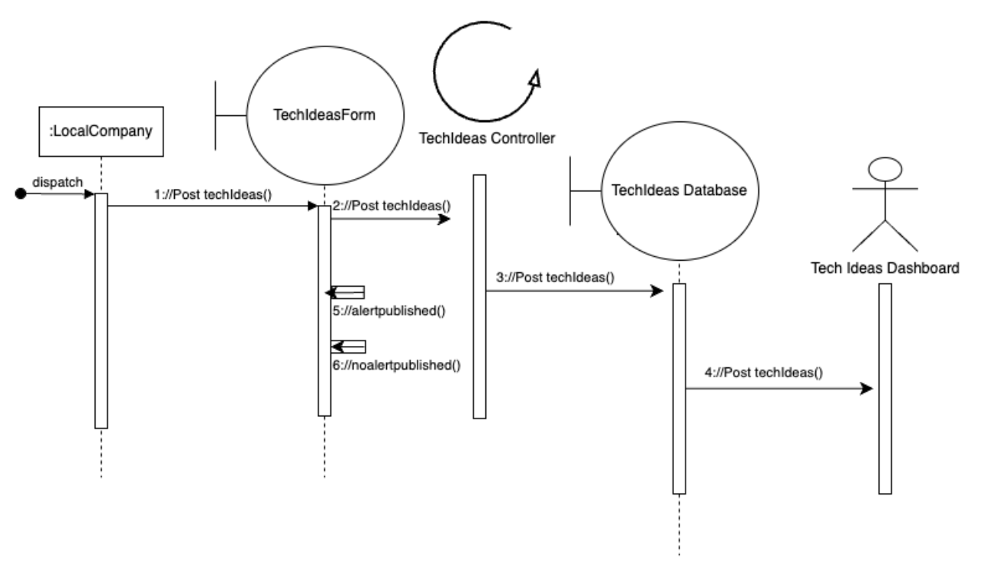

Screenshots of our app are in the sprint3/functionality folder

## To Run:

#### docker setup

Set up the environment

```bash
docker compose up --build
```

For future starts run:

```bash
docker compose up
```

To stop and cleanup:

```bash
docker compose down
```

To Check docker status:

```bash
docker ps
```

To view docker logs:

```bash
docker logs backend
docker logs frontend
docker logs mysql
```

To start mysql with docker:

```bash
docker exec -it mysql mysql -u root -p
```

##### NOTE: This mysql database is a new database made in docker. The docker-compose.yml file runs this mysql instance on port 3307

Enter your mysql password

To query the databases in the docker mysql instance:

```bash
SHOW DATABASES;
USE tech_ideas_db;
SHOW TABLES;
SELECT * FROM jobs;
SELECT * FROM employees;
```

#### backend

cd backend

```bash
./gradlew build
```

in separate terminal run:

```bash
mysql -u root -p
```

enter mysql password to start

Back inside the previous terminal where you ran

```bash

./gradlew build
```

run this command:

```bash
./gradlew bootRun
```

#### frontend

```bash
cd frontend
```

```bash
npm start
```

#### Current System Capabilities

Enter the name of a company

Enter a Tech description

Submit the Tech idea

Show Available Tech ideas

#### What we want to add/change about the system:

For adding new features, we brainstormed this user story idea.

User Story: As a contractor, I want to be able to filter posts to see certain tech ideas to work on

Conditions of satisfaction:

Filter by tech type (from preset categories).  
Filter by date posted (from x date to x date) (calendar drop down)
Filter by budget range (min and max slider in react)

When we make a new post we will have to have fields 1 - 3

1-3 should each be a drop down with visible choices that are in the database


