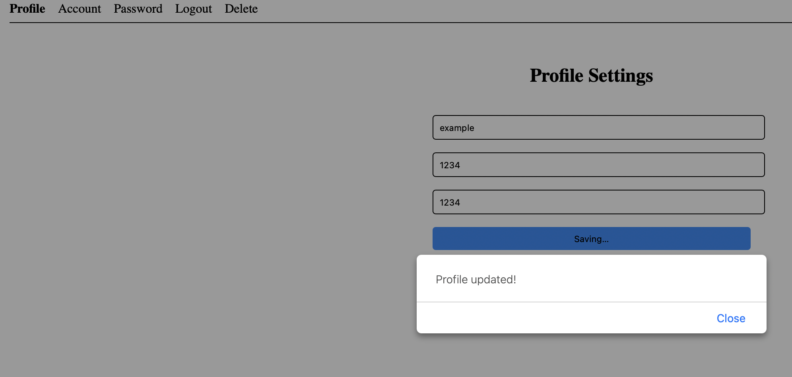
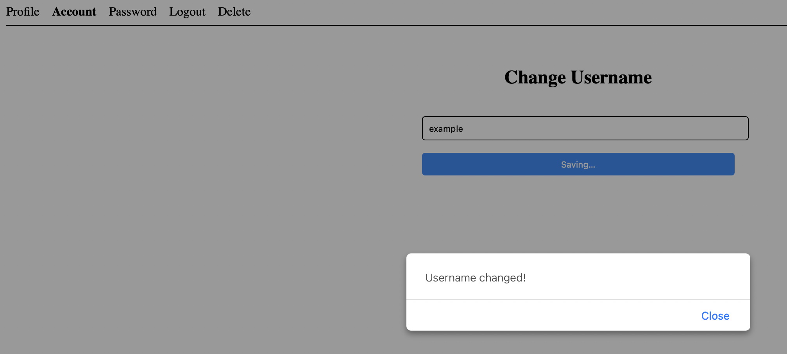
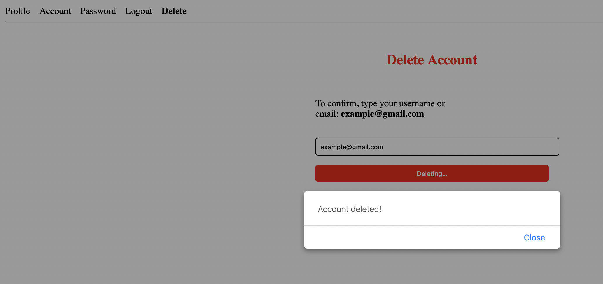

Sprint 2

The team implemented some more functionalities in Sprint 2:

1. Update the Login and Registration to now have an email field.
2. Implement a Forgot Password and Forgot Username function on the login screen.
3. Make a landing page so you don't just jump to the login screen.
4. Modify the settings to not be one page anymore, instead a bunch of individual services.
5. In the settings there is now multiple tabs for updating your details, changing username, changing password, logging out, and deleting your account.
6. The last change was to apply some basic CSS to make everything fit a little better with some padding/margins and have some additional color to make things look a little more appealing.

Below are the screenshots as proof of it working:

