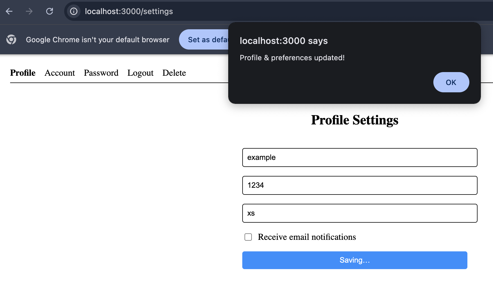
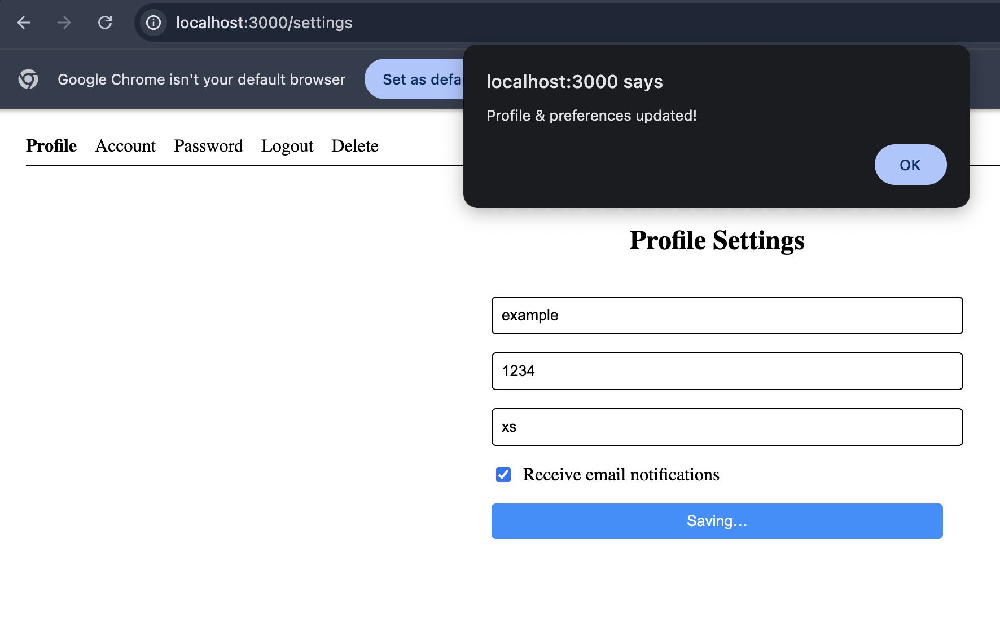
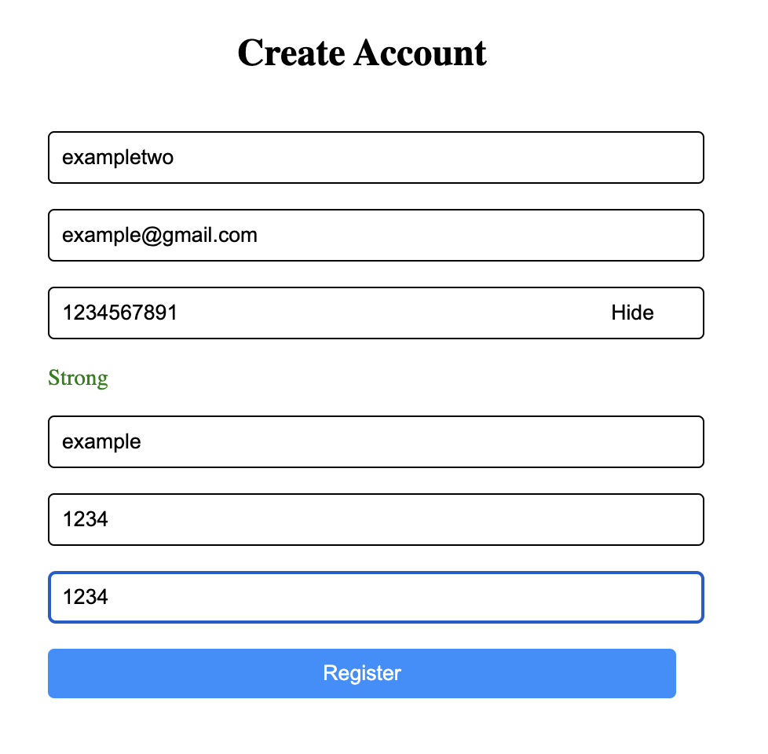

Sprint 3

The team implemented some more functionalities in Sprint 3:

1. The first change in this Sprint was to add a password meter for basic strength functionality. It changes text and color based on how many characters your password is.
2. The show/hide button for the password to hide visibility while typing the password or not.
3. Update email preferences to receive notifications via email or not in the settings page.
4. Alter the delete account to a slow delete functionality that will rather deactivate account, which later could turn into reactivation.
5. Added a Remember Me button

Below are the screenshots as proof of it working:

